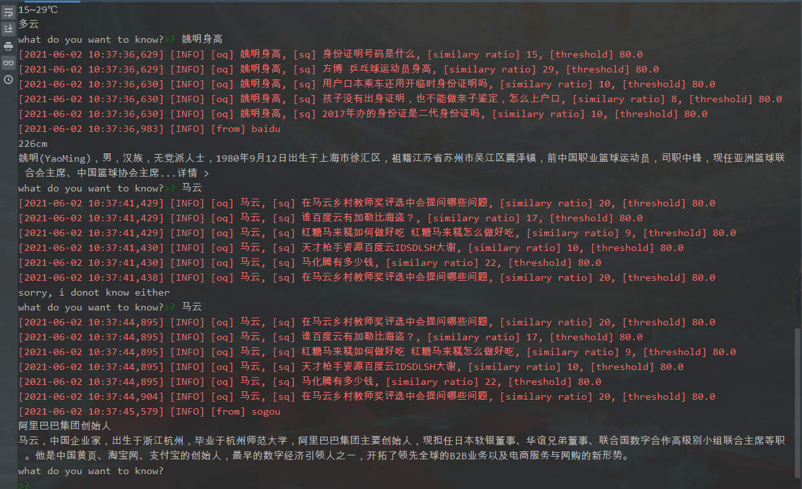

[](https://github.com/xiaodongxiexie/magicMirror)
[](https://github.com/xiaodongxiexie/magicMirror)
[](https://github.com/xiaodongxiexie/magicMirror)
[](https://github.com/xiaodongxiexie/magicMirror)
[](https://github.com/xiaodongxiexie/magicMirror)

# magicMirror

魔镜魔镜，无所不知的魔镜[-_-] //并不是


### 初始化数据

```cmd

pip install -r requirements/base.txt          
python script/start.py
```

### 启动
```cmd

python magicMirror
```   


### 展示效果

